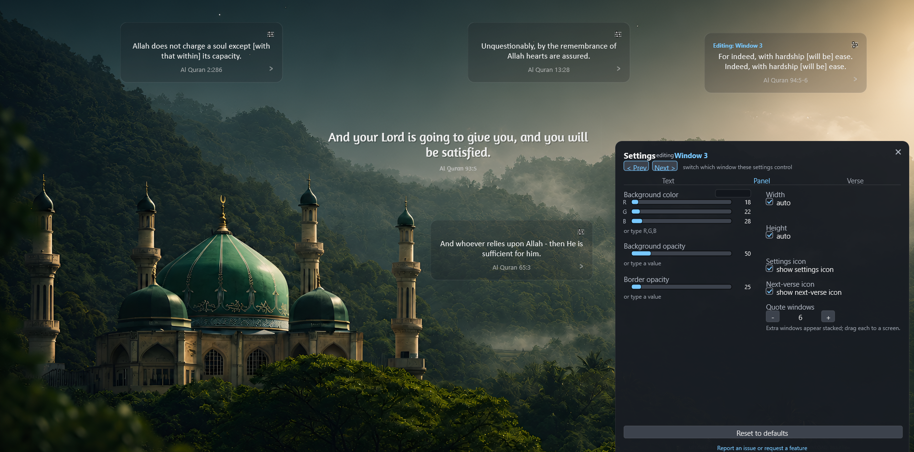
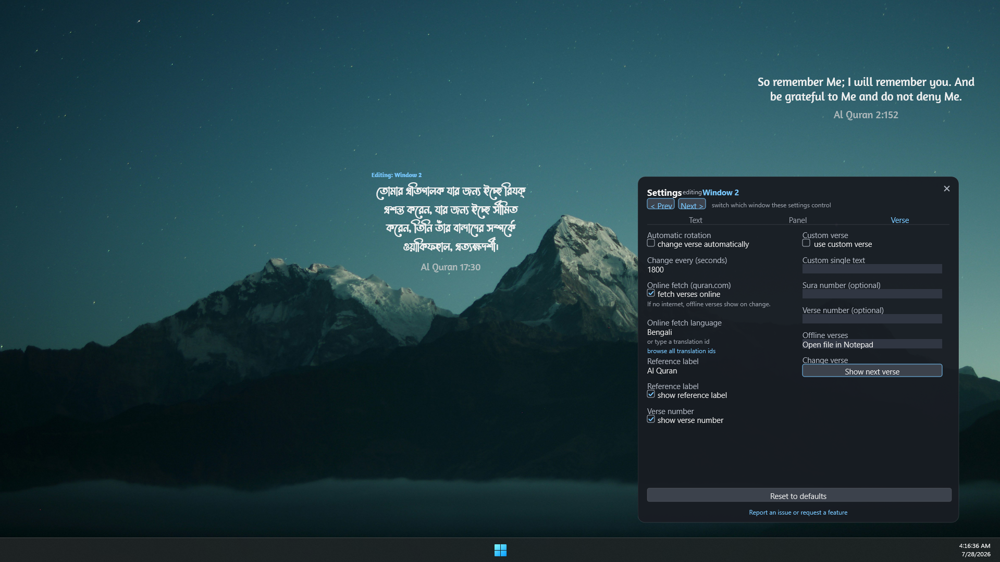

# Al-Quran Quote - Rainmeter Skin

A minimal [Rainmeter](https://www.rainmeter.net) skin for Windows that shows a verse from the Holy Quran
(Saheeh International English translation) with its reference on a soft, semi-transparent panel. A new
verse appears on a timer, or on demand. It works offline out of the box, and a settings panel lets you
customise everything without editing files.


## Features

- Shows a Quran verse with its reference; works **offline** out of the box using a bundled list.
- Optionally fetches fresh random verses live from the free [quran.com API v4](https://api-docs.quran.com).
- Auto-rotates on a timer (every 30 minutes by default), or change the verse on demand.
- **Settings panel** for fonts, colours, size, drop shadow, background, rotation, and more, no file editing.
- Show your own **custom verse**, and pick from many online **languages** (including the original Arabic).
- Up to **8 independent windows**, one per screen. Small, self-contained (no bundled fonts or images).

## Documentation

Full, step-by-step user documentation lives in the
**[project Wiki](https://github.com/shibbirweb/rainmeter-skin-al-quran-quote/wiki)**: installation,
every setting explained, languages, multiple windows, custom and offline verses, an FAQ, and
troubleshooting.

## Screenshots

Customise fonts, colours, size, and shadow from the settings panel:


Show up to 8 independent windows, one per screen:



Read verses in many languages, including the original Arabic:



## Install

Easiest: download the `.rmskin` from the [Releases](../../releases) page and double-click it.

Manual:

1. Install Rainmeter from https://www.rainmeter.net.
2. Copy `Skins/AlQuranQuote` from this repo into your Rainmeter skins folder
   (usually `Documents\Rainmeter\Skins\`).
3. Open Rainmeter, click **Refresh all**, then load `AlQuranQuote\AlQuranQuote.ini`.

## Also available on

- **DeviantArt:** [shibbirweb on DeviantArt](https://www.deviantart.com/shibbirweb/art/1360611014)
- **Rainmeter Forum:** [Share Your Creations thread](https://forum.rainmeter.net/viewtopic.php?p=243912)

## Configure

Click the **settings icon** on the panel to open the settings window. From its three tabs (Text / Panel /
Verse) you can change fonts, colours, size, the drop shadow, background, rotation timing, the language,
the reference label, custom verses, and more. Changes apply immediately and are remembered.

See the **[Wiki](https://github.com/shibbirweb/rainmeter-skin-al-quran-quote/wiki)** for every setting
explained in detail. (Advanced users can still edit
`Skins/AlQuranQuote/@Resources/Variables.inc` directly and refresh the skin.)

## Add an offline verse

Append a line to `Skins/AlQuranQuote/@Resources/quotes.txt` in the form:

```
English translation text | Quran X:Y
```

## Contributing

See the [Developer Guide](docs/DEVELOPER.md) for architecture, local setup, debugging, and the
release process.

## Credits

- Verse data: [quran.com API](https://quran.com) (Saheeh International translation).
- License: MIT (see [LICENSE](LICENSE)).
